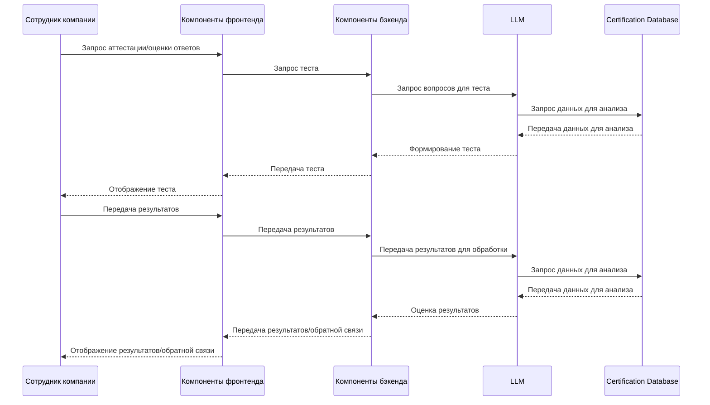
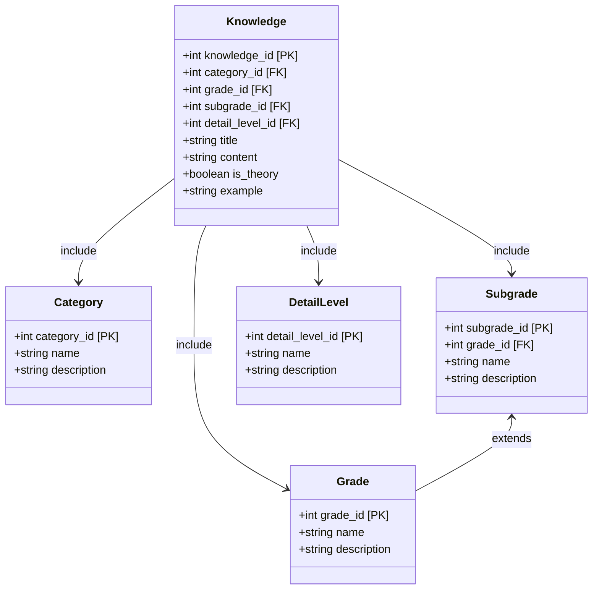

# Лабораторная работа №3. Использование принципов проектирования на уровне методов и классов

---

## 1. Диаграмма контейнеров


---

## 2. Диаграмма компонентов


---

## 3. Диаграмма последовательностей




---

## 4. Модель БД



---

## 5. Применение основных принципов разработки


### KISS (Keep It Simple, Stupid)

#### Клиентский код

**Компонент Question:**
Простой компонент для отображения одного вопроса и поля для ответа.

```javascript
const Question = ({ text, onAnswerChange }) => {
  return (
    <div className="question">
      <p>{text}</p>
      <input type="text" onChange={(e) => onAnswerChange(e.target.value)} />
    </div>
  );
};
```
**Почему KISS:**
Компонент выполняет одну простую задачу — отображает вопрос и поле для ввода ответа. Нет лишней логики или сложных конструкций.


#### Серверный код

**Маршрут для получения вопросов:**
Простое определение маршрута для получения списка вопросов.

```javascript
const express = require('express');
const router = express.Router();
const { getQuestions } = require('../controllers/testController');

router.get('/', getQuestions);

module.exports = router;
```
**Почему KISS:**
Маршрут только связывает URL и функцию-обработчик. Нет лишних проверок или логики.


### YAGNI (You Aren't Gonna Need It)

#### Клиентский код

**Компонент AttestationTest:**
Получение и отображение вопросов без излишней функциональности.

```javascript
const AttestationTest = () => {
  const [questions, setQuestions] = useState([]);

  useEffect(() => {
    const fetchQuestions = async () => {
      const response = await axios.get('/api/tests');
      setQuestions(response.data);
    };
    fetchQuestions();
  }, []);

  return (
    <div>
      {questions.map((question) => (
        <div key={question.id}>
          <p>{question.text}</p>
        </div>
      ))}
    </div>
  );
};
```
**Почему YAGNI:**
Реализована только базовая функциональность — получение и отображение вопросов. Нет кэширования, сложной обработки ошибок или дополнительных фич, которые могут не понадобиться.


#### Серверный код

**Контроллер для получения вопросов:**
Простое получение вопросов из модели и отправка их клиенту.

```javascript
const Test = require('../models/Test');

const getQuestions = async (req, res) => {
  const questions = await Test.getQuestions();
  res.json(questions);
};

module.exports = { getQuestions };
```
**Почему YAGNI:**
Контроллер делает только то, что необходимо — получает вопросы и отправляет их. Нет лишней логики, которая может не понадобиться.


### DRY (Don't Repeat Yourself)

#### Клиентский код

**Функция валидации:**
Общая функция для валидации ввода.

```javascript
export const validateInput = (input) => {
  if (!input) {
    throw new Error("Ввод не может быть пустым");
  }
  return input.trim();
};
```
**Почему DRY:**
Функция вынесена отдельно и может использоваться в разных местах, избегая дублирования кода валидации.


**Использование функции валидации:**

```javascript
import { validateInput } from '../utils/validation';

const handleSubmit = (answer) => {
  const validatedAnswer = validateInput(answer);
  
};
```
**Почему DRY:**
Функция валидации используется повторно, избегая дублирования кода.


#### Серверный код

**Функция валидации:**

```javascript
const validateInput = (input) => {
  if (!input) {
    throw new Error("Ввод не может быть пустым");
  }
  return input.trim();
};

module.exports = { validateInput };
```
**Почему DRY:**
Общая функция валидации, которую можно использовать в разных частях приложения.


**Использование функции валидации:**

```javascript
const { validateInput } = require('../utils/validation');

const submitAnswers = async (req, res) => {
  const validatedAnswers = req.body.answers.map(answer => validateInput(answer));
  // Дальнейшая обработка ответов
};
```
**Почему DRY:**
Функция валидации используется повторно в контроллере, избегая дублирования кода.

### SOLID

#### Клиентский код

**S (Single Responsibility Principle): Компонент Question**
Компонент отвечает только за отображение одного вопроса.

```javascript
const Question = ({ text, onAnswerChange }) => {
  return (
    <div>
      <p>{text}</p>
      <input type="text" onChange={(e) => onAnswerChange(e.target.value)} />
    </div>
  );
};
```
**Почему S:**
Компонент выполняет только одну задачу — отображение вопроса и поле для ответа.


**O (Open/Closed Principle): Компоненты BaseTest и TimedTest**
Базовый компонент для отображения вопросов и расширенный компонент с таймером.

```javascript
const BaseTest = ({ questions }) => {
  return (
    <div>
      {questions.map(question => (
        <div key={question.id}>{question.text}</div>
      ))}
    </div>
  );
};

const TimedTest = ({ questions, timeLimit }) => {
  return (
    <div>
      <BaseTest questions={questions} />
      <div>Time left: {timeLimit} seconds</div>
    </div>
  );
};
```
**Почему O:**
`TimedTest` расширяет `BaseTest`, добавляя функциональность таймера, не изменяя базовую логику.

**L (Liskov Substitution Principle): Логгеры Logger и FileLogger**
Базовый класс логгера и его расширение для записи в файл.

```javascript
class Logger {
  log(message) {
    console.log(message);
  }
}

class FileLogger extends Logger {
  log(message) {
    super.log(message);
  }
}

const logger = new FileLogger();
logger.log("Test message");
```
**Почему L:**
`FileLogger` может использоваться везде, где ожидается `Logger`, без нарушения функциональности.


**I (Interface Segregation Principle): Интерфейсы QuestionProvider и AnswerValidator**
Разделение интерфейсов на специфичные задачи.

```javascript
class QuestionProvider {
  getQuestions() {}
}

class AnswerValidator {
  validateAnswers() {}
}
```
**Почему I:**
Интерфейсы разделены на специфичные задачи, избегая создания одного большого интерфейса.

**D (Dependency Inversion Principle): Сервис TestService**
Сервис зависит от абстракции `QuestionProvider`, а не от конкретной реализации.

```javascript
class TestService {
  constructor(questionProvider) {
    this.questionProvider = questionProvider;
  }

  getQuestions() {
    return this.questionProvider.getQuestions();
  }
}
```
**Почему D:**
`TestService` зависит от абстракции, что позволяет легко заменять реализации.


#### Серверный код

**S (Single Responsibility Principle): Модель Test**
Модель отвечает только за работу с данными вопросов.

```javascript
class Test {
  static async getQuestions() {
    
  }
}
```
**Почему S:**
Модель выполняет только одну задачу — работу с данными вопросов.


**O (Open/Closed Principle): Классы BaseTest и TimedTest**
Базовый класс для тестов и его расширение с таймером.

```javascript
class BaseTest {
  constructor(questions) {
    this.questions = questions;
  }

  getQuestions() {
    return this.questions;
  }
}

class TimedTest extends BaseTest {
  constructor(questions, timeLimit) {
    super(questions);
    this.timeLimit = timeLimit;
  }

  startTimer() {
    
  }
}
```
**Почему O:**
`TimedTest` расширяет `BaseTest`, добавляя функциональность таймера, не изменяя базовую логику.


**D (Dependency Inversion Principle): Сервис TestService**
Сервис зависит от абстракции `QuestionProvider`.

```javascript
class TestService {
  constructor(questionProvider) {
    this.questionProvider = questionProvider;
  }

  getQuestions() {
    return this.questionProvider.getQuestions();
  }
}
```
**Почему D:**
`TestService` зависит от абстракции, что позволяет легко заменять реализации `QuestionProvider`.


### BDUF
Полное проектирование системы до начала разработки.

- **Отказ.** В современной agile-разработке полное проектирование до начала разработки нецелесообразно. Особенно для проектов, где требования могут меняться в процессе разработки.
- **Обоснование:** Проект аттестации сотрудников может развиваться и изменяться по мере получения обратной связи от пользователей. Полное проектирование на начальном этапе может привести к излишним затратам времени и ресурсов.


### SoC
Разделение логики на отдельные модули, каждый из которых отвечает за свою часть функциональности.

- **Использовать.** Этот принцип позволяет сделать код более поддерживаемым и модульным.
- **Обоснование:**
  - Разделение на компоненты для отображения, логики взаимодействия с пользователем и работы с API.
  - Разделение на маршруты, контроллеры, сервисы и модели данных.
  - Это позволяет легче поддерживать и расширять систему, а также упрощает тестирование и отладку.

### MVP
Создание минимально жизнеспособного продукта для быстрого тестирования и получения обратной связи.

- **Использовать.** Это позволит быстро выпустить базовую версию продукта и получить обратную связь от пользователей.
- **Обоснование:**
  - На начальном этапе можно реализовать базовую функциональность: прохождение тестов и получение результатов.
  - Это позволит быстро протестировать основные гипотезы и собрать отзывы пользователей для дальнейшего улучшения продукта.

### PoC 
Создание прототипа для проверки жизнеспособности концепции.

- **Использовать.** Особенно для проверки интеграции с языковой моделью (LLM) для генерации вопросов и оценки ответов.
- **Обоснование:**
  - Прототип позволит проверить, насколько эффективно LLM может генерировать вопросы и оценивать ответы.
  - Это поможет избежать рисков и затрат на разработку полноценной системы, если концепция окажется нежизнеспособной.


